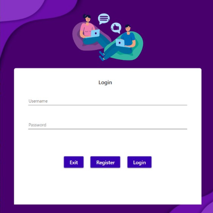
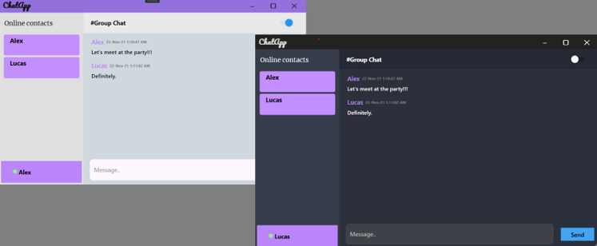

# ChatApp

This app has been designed using WPF and the backend using C# and Firebase (Desktop based application for windows). The user interface that the software provides to the user is interactive. It provides two different forms, one for listing the online contacts and the other for the actual text chatting both of which are synced with backend.

- The project is basically based on the public or group chatting wherein the user’s message will be 
broadcasted to all other users who are connected at that moment. Hence this application aims for 
providing security among the group itself.

## Images

## Tech 

- [WPF](https://docs.microsoft.com/en-us/dotnet/desktop/wpf/?view=netdesktop-6.0) - WPF for building desktop apps!
- Visual Studio - awesome text editor
- [AES algorithm](https://docs.microsoft.com/en-us/dotnet/api/system.security.cryptography.aes?view=net-6.0) - great algorithm for encryption and decryption use
- [Firebase](https://firebase.google.com/) - firebase for storing messages

## Installation
Download and run .exe file from bin folder.
Note: This app is still under development, it might not work as expected.

